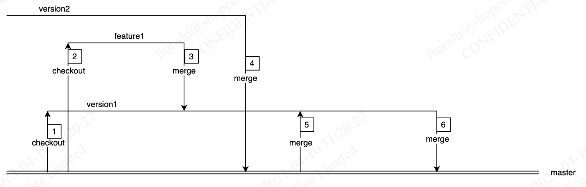

## 分支管理
1. 每个独立的需求都有自己的独立的feature分支，该分支应该持续集成该feature相关的全部代码。所以所有非live环境的bug的修复，都应该在feature分支进行，然后再同步到各个环境（UAT，test）。
2. 保持每个feature分支的独立性，如果没有强依赖关系，所有feature分支应该基于master。前后版本之间的featrue分支如果有依赖关系，也应该只依赖上个版本对应的feature分支，而不是整个上个版本。
3. UAT环境上的代码应该尽量贴合未来的上线环境。

`master`（长期分支）

职能：用于拉 feature 分支，用于staging和发布上线，不能 commit ，只接受release分支和hotfix分支的合并。每次改动后，需要将master分支合并回所有UAT上的release分支和所有test分支。另外每次对master的合并，都应该增加一个tag，tag规范为live-[版本号]-[发布日期]-(hotfix-[Jira单])

`release-[版本号]-[发布日期]`（临时分支，可能存在多个）

职能：用于虚拟多套测试环境和uat，不能 commit 以及尽量避免频繁修改。只接受来自feature分支的合并，每次进行uat的时候，都从master分支拉出release-[版本号]-[发布日期]分支，然后再将会在它之前上Live，但是还没有合并入master的所有release分支合并进去，最后合并入全部版本需要的需求分支。

注意：

如果某个版本会分多次发布，就应该拉出多个release分支，根据上面的要求，每个release分支，都从master拉出，然后合并入上个和这个版本计划在它之前上Live的release分支。
在UAT期间，如果master分支有hotfix，应该将master分支合并回在UAT中的release分支。
有任何UAT的bug，都不可以直接在上面修改，你需要在对应的feature分支上修复，然后再合并入release和test分支。

`feature`

职能：用于开发需求。每次从master分支新建一个 feature 分支，命名为feature-MITAR-XXXX-[描述]，MITRA-XXXX 表示 JIRA 的 TASK 编号，比如feature-MITRA-1234-transaction-history。

`hotfix`

职能：用于修改 master 等各个分支环境下产生的BUG，需要从 master 分支拉取，命名为 hotfix-XXXX，XXXX 表示 JIRA 的 BUG 编号。

## 代码合并规范
1. 背景
   FE和BE在做版本迭代时，如果遇到并行的几个版本合并，会出现已有的代码被冲突解决解掉导致功能丢失的问题，针对此问题，我们需要确定合并代码的规范。

2. 名词解释

| 名词               | 解释                                                                                                                                           |
| ------------------ | ---------------------------------------------------------------------------------------------------------------------------------------------- |
| feature分支        | 对应版本内每个dev需求 每个版本的feature分支都需要从master分支拉出来                                                                        |
| release分支        | 对应每个迭代版本，一般的命名规范是release-[version name] 每个release分支需要从master分支拉出来                                            |
| master分支         | 线上运行的代码分支                                                                                                                             |
| 各端版本发布负责人 | 负责当前版本发布的所有事宜，包括代码合并、冲突解决和cicd上发布版本的流水线管理等 在version确定之初由leader来分配 (需要职级在senior或以上) |

3. 场景
   正常的需求版本检出和合并过程

操作1和操作6涉及release-version1分支的checkout和merge，需要由version1的版本发布负责人来操作；

操作2和操作3涉及feature1的checkout和merge，需要由feature1的dev来操作；

操作4涉及version2合并到master的操作需要version2的版本负责人来操作；

操作5在version2上live后需要同步最新的master代码到version1分支，需要version1的版本负责人来操作；

注意：涉及到当前version分支的merge、checkout和resolve conflict等操作都需要各端的版本负责人参与。

**question1：如何确定各端版本负责人？**

answer：在版本需求宣讲之前由各端leader确定 (需要职级在senior或以上)

**question2：操作3feature1分支的提测合并出现冲突，如何解决？**

answer：

dev需要从version1分支切出来一个fix-version1-feature1分支；
将feature1合入fix-version1-feature分支，如果出现冲突需要跟version1的版本负责人一并修改；
如果出现了较多冲突，需要版本负责人拉上相关冲突的dev，在会议中进行review修改；
处理好冲突后将fix分支合并到release version版本中

**question3：操作4和操作6从version2合并到master产生冲突，如何解决？**

answer：

版本负责人需要从master拉一个fix-master-version的分支
出现冲突需要拉对应的dev一起解决

**question4：操作5从master合并到version1产生冲突，如何解决？**

answer：

版本负责人需要从version1分支拉一个fix-version1-master分支；
出现冲突需要拉对应的dev一起解决