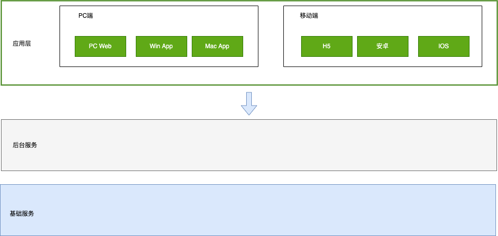
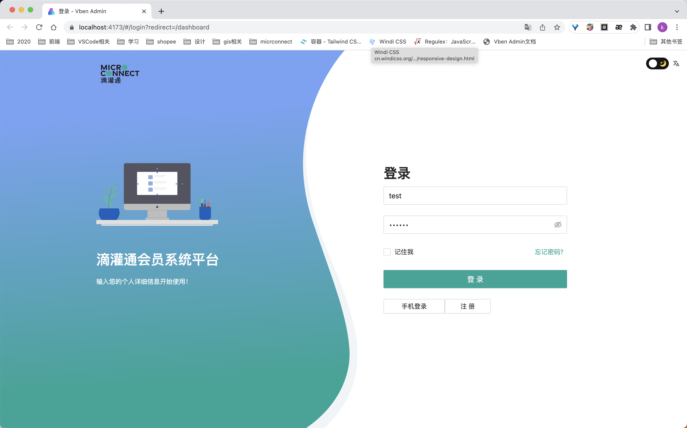
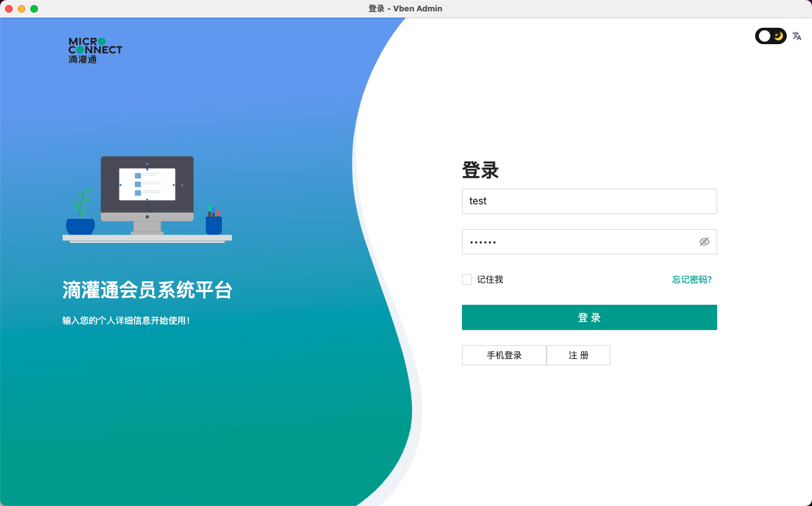
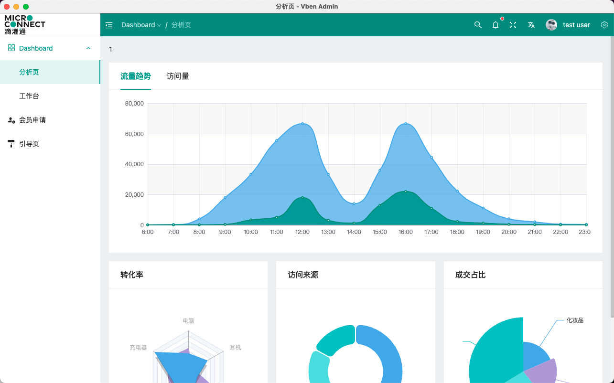

# 大前端技术

## 名词解释

| 术语         | 定义                                                                                                                                                                                                                               |
| ------------ | ---------------------------------------------------------------------------------------------------------------------------------------------------------------------------------------------------------------------------------- |
| Vue          | Vue.js 是一个轻量级、渐进式的 JavaScript 框架，用于构建用户界面。它支持可复用的组件、高级特性、优秀的性能表现，适用于各种类型的应用程序，被广泛应用于前端开发领域。                                                                |
| React        | React.js 是 Facebook 开发的一种用于构建用户界面的 JavaScript 库，采用虚拟 DOM 技术来提高性能，提供了一些易用的功能，适用于构建各种类型的应用程序。                                                                                 |
| React Native | React Native 是 Facebook 推出的一种基于 React.js 开发的跨平台移动应用程序开发框架，它可以让开发者使用 JavaScript 和 React.js 的语法来构建原生应用程序。                                                                            |
| WebView      | WebView 是一种在移动应用程序中嵌入 Web 内容的技术，允许应用程序将 Web 内容作为应用程序的一部分展示给用户。具体来说，它是一种基于浏览器引擎的控件，可以将网页嵌入到原生应用程序中并与本地应用程序交互，可以实现混合应用程序的开发。 |

## 技术分析

### 渲染性能

3大主流渲染引擎里，webview渲染、js调用原生渲染（react native/weex/uni-app）、flutter自绘渲染，复杂度依次降低，渲染性能依次上升。

但是flutter是一个纯排版引擎，绘制文字、按钮、图片等常用界面控件，这个排版引擎的特点是简单、高性能

### PC端vs移动端适配

一般网站实现pc端与移动端适配的需求，方案有两个：

1、一套页面，从设计时就考虑到跨设备适配，响应式的一步到位；

2、开发两套页面，根据设备尺寸加载加载不同的资源；

#### 响应式方案

使用媒体查询来控制样式，根据设备不同配置多套样式。需要UI设计时就考虑到适配问题

#### 两套页面的方案

对外宣传用同一个链接，但是该链接在移动端与pc端打开，会分别自动跳转到两个不同的详细的链接。展示页面与业务逻辑进行分离，两套展示页面共用业务逻辑。

## 开发框架对比

### 桌面跨端应用

| 框架     | 技术特点                       | 优点                                                           | 缺点                                                           |
| -------- | ------------------------------ | -------------------------------------------------------------- | -------------------------------------------------------------- |
| Electron | 基于Chromium和Node.js构建      | 开发效率高、支持跨平台、社区活跃、丰富的第三方库和工具支持     | 应用体积较大、性能相对较低、UI设计较为简单、多窗口处理较为繁琐 |
| Flutter  | 基于Dart语言和自有的UI渲染引擎 | 跨平台、高性能、灵活的UI设计、热重载、丰富的Material组件库支持 | 学习成本较高、目前桌面应用开发支持较为有限、需要依赖第三方库   |

### 移动端跨端应用

| 框架         | 技术特点                                                                                                                                 | 优点                                                       | 缺点                                                    |
| ------------ | ---------------------------------------------------------------------------------------------------------------------------------------- | ---------------------------------------------------------- | ------------------------------------------------------- |
| Uniapp       | 跨平台应用开发引擎<br />基于Vue.js框架，一次编写，[处处可运行的理念](https://uniapp.dcloud.net.cn/#%E5%BF%AB%E9%80%9F%E4%BD%93%E9%AA%8C) | 跨端开发成本低、学习成本低、开发效率高                     | UI效果较一般、性能不如原生                              |
| Flutter      | 基于Dart语言、自带渲染引擎                                                                                                               | 性能好、灵活性高、UI效果好                                 | 学习成本高、使用限制较多                                |
| React Native | 基于 React.js 构建，让开发者使用 JavaScript 和 React.js 的语法来构建原生应用程序。                                                       | 开发体验好、社区支持广泛。应用程序更加响应迅速、交互自然。 | UI灵活性相对较差、性能不如原生                          |
| Taro         | 基于React.js 、支持多端开发                                                                                                              | 支持多端开发、性能好、开发效率高                           | 尚未完全支持所有原生API、调试问题相对较多               |
| Weex         | 基于Vue.js框架、自带渲染引擎                                                                                                             | 性能好、灵活性高、开发效率高                               | 社区支持相对较弱、可能存在一些问题，如框架稳定性等等    |
| Finclip      | 提供基于Webview的跨端容器、支持自定义Native插件开发，给已有App接入小程序功能                                                             | 集成简单、支持自定义插件开发、安全性高                     | 需要依赖Finclip的跨端容器、可能存在一些限制和兼容性问题 |


#### 详细对比

##### flutter与uni-app的比较：

- flutter与uni-app的相对优势：
  - 性能好一丢丢。比rn有优势，但比拥有bindingx和wxs的uni-app，在实际开发中没有很明显的差距。
- flutter与uni-app的相对劣势：
  - 需要原生协作，维护3套代码，无法有效降低开发成本，提升开发效率
  - 嵌套地狱，代码难看难维护
  - 不支持热更新
  - 目前质量和成熟度很低
  - 原生可视控件融合不好，比如webview、video、map
  - ui库不适合国情
  - 学习成本高
  - 应用场景有限，dart未来扑朔迷离

##### rn和uni-app的比较：

- rn与uni-app的相对优势：

  - rn的坑虽然比weex的少，但uni-app已经填了weex的很多坑。这方面差别不大。
  - rn的生态虽然比weex丰富。但uni-app是反过来的，uni-app的国内应用生态丰富度超过了rn。
  - rn是纯单页的，嵌入原生App比较灵活。而uni-app是应用整体的概念，如果要内嵌入其他原生应用的话，要求原生应用内嵌uni-app应用整体进来。即集成[uni小程序sdk](https://ask.dcloud.net.cn/docs/#https://ask.dcloud.net.cn/article/36941)。

- rn与uni-app的相对劣势：

  - 需要原生协作，维护3套代码，无法有效降低开发成本，提升开发效率
  - 不支持小程序，发布到h5也无法直接发
  - 性能不如uni-app
  - 国内的插件生态不如uni-app丰富
  - ui库不适合国情，learn once，write anywhere
  - 学习成本高，用人成本高，不利于开发商降低开发成本
  - rn是纯单页应用，如果一个应用的页面很多，用rn写会很崩溃，变量污染和干扰严重。而weex/uni-app支持多页面，页面之间上下文隔离，写页面较多的大型应用更合适
    另外react在中国的市场占有率远不如vue。这也是中国与国外不同的特色情况。

### uniapp介绍

#### 整体架构图


#### App端架构图


#### 生态圈

- 丰富的插件市场为开发者提供数千款现成的轮子，[https://ext.dcloud.net.cn](https://ext.dcloud.net.cn/)
- 兼容微信小程序 JS SDK，丰富的小程序生态内容可直接引入uni-app，并且在App侧通用，[参考](http://ask.dcloud.net.cn/article/35070)
- 兼容微信小程序自定义组件，并且App、web侧通用，[参考](http://uniapp.dcloud.io/tutorial/miniprogram-subject#小程序自定义组件支持)
- App和web提供了renderjs，使得浏览器专用的库也可以在App和web里使用，[参考](https://uniapp.dcloud.io/tutorial/renderjs)
- 支持 NPM 包管理系统，[参考](http://uniapp.dcloud.io/tutorial/page-script#npm支持)
- 支持 mpvue 项目及组件，[参考](http://ask.dcloud.net.cn/article/34945)
- 支持原生插件，见插件市场：[https://ext.dcloud.net.cn](https://ext.dcloud.net.cn/)
- 支持App原生工程里嵌入uni小程序sdk，打造自己的**小程序平台**，实现平滑迁移。

#### 兼容性

1. Web端：uni-app没有限制，同vue2和vue3自身能支持的浏览器版本
2. 小程序端：uni-app没有限制，同该小程序自身能支持的最低平台
3. App端：
   - Vue2: Android4.4+、iOS9+。Android4.4已经是2013年发布的手机了。
   - Vue3: 支持的范围是：Android >=5 （使用nvue和vue有区别。某些老国产Android5的rom无法动态升级Android system webview，此时如果使用vue页面需搭配x5内核） , iOS >= 10

#### 成熟度

`uni-app`在2018年夏天推出，目前版本成熟，生态资源丰富，是当今主流的开发框架，案例众多，手机端引擎月活已经突破10亿

****

### 项目选型

#### 整体架构



#### PC端

技术栈 `Vue3.0`、`Vite`、 `Ant-Design-Vue`、`TypeScript`，方便后期接入`Electron`实现CS。

PCWeb 常用命令

```sh
yarn dev

yarn build
```



PC 应用常用命令

```sh
yarn dev:app

yarn build:app
```





#### 移动端

移动端基于`vue` 使用`uni-app`进行混合开发
