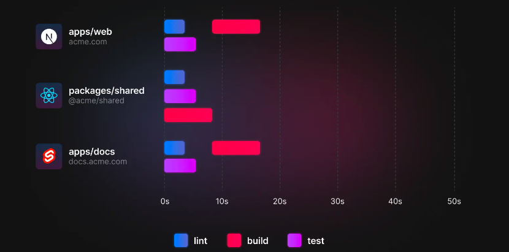

# TurboRepo

>Turbo 是一个用 Rust 编写的，针对 JavaScript 和 TypeScript 进行了优化的快速构建系统。

## Monorepo

在版本控制系统中，Monorepo（“mono”意为“单一”，“repo”是“存储库”的缩写）是一种软件开发策略，其中多个专案的程式码存储在同一个存储库里面。

在 Monorepo 项目中你可以同时管理多个逻辑共存的应用程序，比如桌面应用程序和 Web 应用程序，甚至 Ios 应用也可以保存在 Monorepo 中，只要你愿意的话。

**Monorepo优点**

- 方便程式码重复利
类似的功能或沟通协定可以抽像到共享工具库中并直接包含在专案中，而不需要依靠套件管理器。
- 简化相依性套件管理
在多个专案依赖于第三方相依性套件的多存储库环境中，该相依性套件可能会被多次下载或构建。在 monorepo 中，可以轻松优化构建，因为所引用的相依性套件都储存于同一程式码库中。
- 原子化提交（Atomic commit）
当一起运作的专案包含在单独的存储库中时，发布需要同步一个专案的哪些版本与另一个专案一起运作。在相当庞大的专案中，管理相依套性件之间的相容版本可能会变成相依套件地狱（Dependencies hell）。在 monorepo 中，这个问题可以被解决，因为开发者可以原子化的方式修改多个专案。
- 大规模程式码重构
由于开发者可以存取整个专案，重构可以确保专案的每一个地方在重构之后可以继续运作。
- 跨团队协作
在使用原始相依性套件（从原始程式码编译的相依性套件）的 monorepo 中，团队可以改善其他团队正在进行的专案。这样能让程式码所有人更富有弹性。

## 基于 Monorepo 的传统解决方案

### Lerna

Lerna 是一个工具，可以优化使用 git 和 npm 管理多包存储库的工作流程。

Lerna 主流应用在处理版本、构建工作流以及发布包等方面。

你可以将 Lerna 管理的项目理解成为一个大的文件夹，其中每一个文件夹中都会包含一个独立的应用程序文件夹。

在独立的应用程序文件夹外，我们拥有一个大的文件夹来管理每个独立的文件夹，每当我们运行 Lerna 的命令进行构建、发布时，它内部会遍历所有的应用程序从而进行构建对应的包以及自动化的更新相关依赖版本。

### Yarn

Yarn 1.0 版本中，开发人员发布了一个名为 Workspaces 的功能主要用于基于 Monorepo 方案来管理多个应用程序之间的依赖处理。

通常业界主流基于 Lerna 负责发布和版本控制，而使用 Yarn Workspaces 来管理多个应用程序之间的依赖。

## 为什么选择 TurboRepo

上述提到传统的 Monorepo 解决方案中，项目构建时如果基于多个应用程序存在依赖构建，耗时是非常可怕的。

TurboRepo 的出现，正是解决 Monorepo 慢的问题。

yarn 
turbo 

TurboRepo 支持多个任务的并行处理，完美了的解决了 Lerna 构建时类似“单线程”的不足。

### 优点

#### 更快的增量构建

TurboRepo 的基本原则是从不重新计算以前完成的工作, Turborepo 会记住你构建的内容并跳过已经计算过的内容，在多次构建开发时，这也就意味更少的构建耗时。

#### 通过内容生成 Hash 甄别文件变动

Turborepo 检查文件内容变动时，会根据内容生成 Hash 来对比，而不是粗略的利用时间戳来确定需要构建的内容。

#### 云缓存

通常针对于构建时产生的缓存文件大部分时都会记录在本地硬盘中，在多人合作或者 Docker 构建中这也就意味着仍然需要首次巨大的耗时构建生成缓存才会提升效率。

但 TurboRepo 开发团队提供了一项名为“云缓存”的功能，它支持将本地 turborepo 链接到远程缓存从而实现多人合作时共享缓存。

#### 任务管道

Turborepo 支持在 package.json 中通过 pipeline 定义任务之间的关系，它会让 Turborepo 在构建内容上智能化的分析模块构建串/并执行顺序，从而大大的缩小构建时间。而不是类似于上文提到 Lerna 中仅机器化的支持单个任务的运行。

#### 基于约定的配置

Turborepo 通过约定降低复杂性，使用 Turborepo 我们仅仅关心简单的 json 配置即可完成项目配置。

#### 浏览器中的配置文件

Turbo 支持通过 有--profile标志 生成构建配置文件，你可以将它并将其导入 Chrome 或 Edge 以了解哪些任务花费的时间最长。

#### 新功能

Turbo 官方指出支持使用 Lerna 管理包、发布和更改日志生成，同时使用 Turbo 进行任务运行和缓存。

